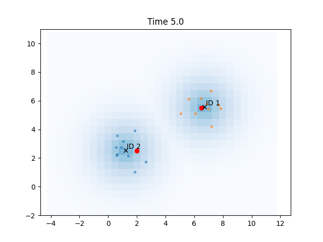

# Real-time Perception System for People Tracking using K-Means Clustering and Gaussian Mapping
This project implements a 2D LIDAR-based real-time perception system in Python that simulates a mobile robot detecting and tracking multiple moving people in a dynamic environment. The system combines:

- K-Means clustering to group noisy LIDAR-like points
- Consistent ID tracking across frames
- Gaussian occupancy grid mapping to model obstacle probability

It visually demonstrates how robots can perceive and understand human positions in real time — a key foundation for human-aware navigation, safety, and decision-making in indoor settings like malls, airports, or office floors.

# Features
- Simulated moving people generating noisy LIDAR data
- Real-time clustering with K-Means
- Inter-frame tracking with persistent IDs
- 2D probabilistic occupancy mapping using Gaussian kernels
- Clean visualization of clusters, tracked IDs, and occupancy grid

# Concepts Used
- K-Means Clustering: Used to identify person-like clusters in LIDAR point data.
- Centroid Tracking: Associates clusters across frames using nearest-neighbor matching.
- Gaussian Occupancy Grid Mapping: Represents uncertainty of obstacles with Gaussian distributions over a 2D grid.

# Applications
This project forms the basis for:
- Human-aware robot navigation
- Autonomous surveillance
- Assistive robotics
- Probabilistic sensor fusion

